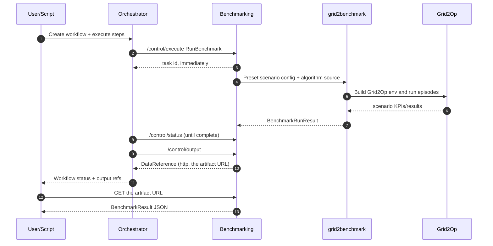

# Dutch Node Benchmarking Use Case (Grid2Benchmark)

This use case runs a canonical protobuf/gRPC benchmark pipeline for network topology optimization algorithms.

## MVP scope
- Benchmark service compatible with AI-Effect control endpoints plus canonical gRPC data-plane artifacts.
- Input payload includes:
  - optional benchmark scenario metadata (`env_name`, `topology`, `time_series`, `backend`)
  - algorithm code template payload
- Algorithm submission model: Python file implementing build_agent(env, context).
- Benchmark engine: grid2benchmark (public repository dependency).
- KPI evaluation: delegated to grid2benchmark; results are serialized as canonical `BenchmarkRunResult` (structured scenarios + summary aggregates).
- Scenario source: a preset grid2op environment (`l2rpn_case14_sandbox` by default), configured via `benchmark.scenarios`. This service is standalone -- it does not ingest grid data from the data synthesizer.
- Packaging:
  - Docker use-case deployment
  - Python package via pyproject.toml

## Key files
- main.py: service entrypoint
- benchmark/benchmark_operations.py: RunBenchmark operation implementation
- proto/benchmarking.proto: benchmark service protobuf contract (service-local)
- algorithms/algorithm_template.py: user algorithm template
- algorithms/greedy_baseline.py: baseline algorithm (generic no-op action policy)
- ../../export/{blueprint,dockerinfo}.json: orchestrator workflow metadata,
  generated by scripts/onboarding-export-generator.py
- run_workflow.sh: end-to-end orchestration run script

## Protobuf layout and generation
- Protobuf files are service-local (no `shared/proto` for Dutch node service contracts):
  - `benchmarking/proto/benchmarking.proto`
- Benchmark service generates python stubs from its own proto root only; it serves `BenchmarkingService` and calls no other service.
  - `GridData` is retained in the proto for wire compatibility but is not read by the service.
- Docker builds compile protobufs during image build. The benchmark service reads no proto at runtime; `benchmarking.proto` is the portal's interface description.

## Running it

The service publishes no host port (FR-19, FR-27). It is reachable only on the
`ai-effect-services` network, at the address `export/dockerinfo.json` names —
`benchmark-runner:8080` — which is where the orchestrator's workers dial it.
`curl http://localhost:8004/health` no longer applies; there is nothing there.

```bash
export NODE_PUBLIC_BASE_URL=https://node.example.org   # as the vendor sees it
export SERVICE_API_KEY=$(openssl rand -hex 32)         # optional; open if unset

cd orchestrator && docker compose up -d                # api, redis, 3 workers
cd ../use-cases/dutch-node-benchmarking && docker compose up -d --build
```

`NODE_PUBLIC_BASE_URL` is required: result references are built from it, so an
internal Docker name here produces URLs the submitting party cannot fetch.

`scripts/start.sh` and `scripts/stop.sh` wrap those two lines.

## Run a benchmark through the orchestrator

```bash
SERVICE_API_KEY=<same key> ./run_workflow.sh
```

The script submits the exported blueprint, waits for the workflow, and fetches
the artifact the result reference points at — the full path a vendor walks. It
checks first that the orchestrator is up, that its workers are running, and that
the service answers at its `dockerinfo.json` address *from inside a worker*,
because that is the call that has to succeed and a probe from the host would
prove nothing.

| Variable | Default | Purpose |
|---|---|---|
| `ORCHESTRATOR_URL` | `http://localhost:18000` | Where to submit |
| `ORCHESTRATOR_API_KEY` | unset | Bearer token on the orchestrator API |
| `SERVICE_API_KEY` | unset | Forwarded to the service as `services_api_key`. Must match the container's, or the worker's call is rejected with 401 |
| `ALGORITHM` | `algorithms/algorithm_template.py` | Source to benchmark |
| `MAX_STEPS` | `100` | Steps per episode |
| `KPIS` | all three below | Comma-separated KPI names |
| `OUTPUT_DIR` | `./results` | Where the fetched result is written |

### KPI names

`grid2benchmark` validates KPI names and rejects the whole run on an unknown
one. It computes `carbon_intensity`, `operation_score` and
`topological_action_complexity`. The `survival` / `violations` / `latency`
figures that appear in results are the *fallback* metrics this service derives
itself when grid2benchmark returns none — they are not accepted as a request.

## Designer/runtime topology
- `export/blueprint.json` and `export/dockerinfo.json` are generated by `scripts/onboarding-export-generator.py` and describe this service alone.
- `RunBenchmark` is the single entry operation, so a workflow submission yields exactly one start node.

## Benchmark sequence diagram


There is no gRPC leg. The service runs no gRPC server; the results data plane is
the HTTP artifact endpoint, and `benchmarking.proto` remains the portal's
interface description only.

## Local example smoke test with baseline algorithm

`scripts/local_test_greedy.py` talks to the service directly rather than through
the orchestrator, so it needs a reachable base URL. The container publishes no
host port, so either run the service outside Docker, or point the script at the
node's public route:

```bash
python scripts/local_test_greedy.py --base-url http://localhost:8444/svc/benchmark
```

It submits an inline payload with `algorithms/greedy_baseline.py` and fetches the
KPI output from `/control/data/{job_id}`.

## Python package flow
- Build package artifacts from this folder:
  - python -m pip install --upgrade build
  - python -m build
- Run local CLI:
  - python benchmark_cli.py --algorithm algorithms/algorithm_template.py
  - python benchmark_cli.py --algorithm algorithms/greedy_baseline.py

## Canonical Control Payload (inline JSON)
{
  "benchmark": {
    "max_steps": 100,
    "kpis": ["carbon_intensity", "operation_score"],
    "scenarios": [
      {
        "env_name": "l2rpn_case14_sandbox",
        "time_series_ids": [0]
      }
    ]
  },
  "algorithm": {"source_b64": "<base64 python source>"}
}

## Scenario-aware benchmark payload
{
  "benchmark": {
    "max_steps": 200,
    "kpis": ["carbon_intensity", "operation_score", "topological_action_complexity"],
    "scenarios": [
      {
        "env_name": "l2rpn_case14_sandbox",
        "topology": {
          "format": "pandapower",
          "path": "./data/grid.json"
        },
        "time_series": {
          "format": "csv",
          "path": "./data/time_series_csv"
        },
        "time_series_ids": [0, 1, 2]
      },
      {
        "env_name": "l2rpn_case14_sandbox",
        "backend": "lightsim2grid",
        "time_series_ids": [7]
      }
    ]
  },
  "algorithm": {"source_b64": "<base64 python source>"}
}

## Output shape notes
- The artifact at `/control/data/{job_id}` is JSON with `environment`,
  `input_summary`, `episodes`, `kpis` and `metadata`.
- Per-scenario metrics are under `metadata.scenarios[*].kpis`.
- `kpis` at the top level are those of the first scenario.
- Scenario field names follow `grid2benchmark`: `env_name`, `time_series_ids`, `topology`, `time_series`, `backend`.

## Supported scenario source formats
- Topology formats: `pandapower`, `pypowsybl`, `cgmes`.
- Time-series formats: `grid2op_chronics_dir`, `csv`, `parquet`.
- For `csv`/`parquet` time-series, grid2benchmark performs conversion into a temporary Grid2Op-compatible environment.
- For `grid2op_chronics_dir`, existing Grid2Op chronic directories can be consumed directly.

## Notes on dependencies
- `requirements.txt` installs `grid2benchmark` from the public GitHub repository at branch `main`.
- `requirements.txt` also installs `grid2evaluate` and a specific version of `grid2op` from GitHub because it is not currently published on PyPI.
- `pyproject.toml` references `grid2benchmark` directly for package metadata.
- Because `grid2benchmark` is installed from GitHub, Docker layer cache can pin older commits. Use a no-cache rebuild when validating newly added format support:
  - `docker compose build --no-cache benchmark-runner` from the use case root

## Next extension
- Strong isolation mode (subprocess or per-run container) for untrusted code.
